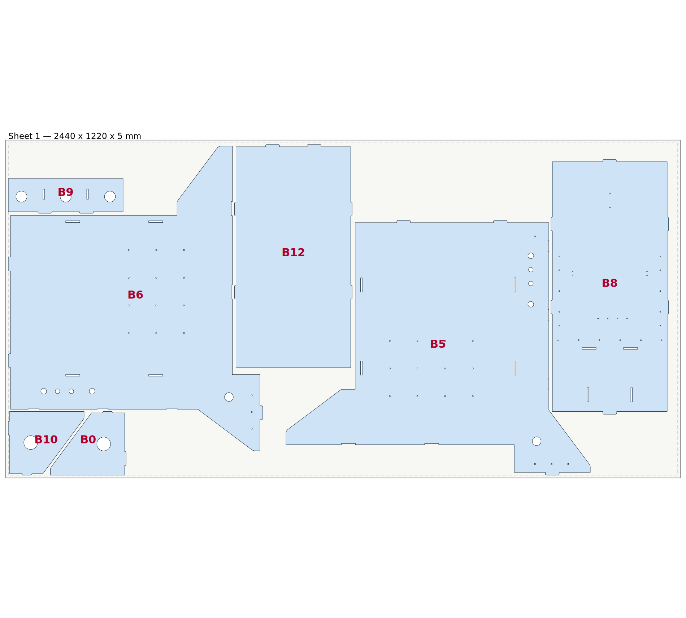

# CNC Workstation V1 — 5 mm laser-cut nest

Flat-pattern nest of every **5 mm** plate in `CNC_WorkstationV1.step`, arranged for
laser cutting on a single **2440 × 1220 × 5 mm** sheet (mild steel / stainless, fiber laser).



## What got nested

The source STEP contains 17 solids. Thickness was measured from the geometry itself
(largest pair of opposed parallel planar faces), not from the bounding box — several
parts sit at an angle in the assembly, so bounding boxes lie.

| Body | Thickness | In the nest? |
|---|---|---|
| Body11, Body5, Body6, Body8, Body9, Body10, Body16 | **5.0 mm** | ✅ all 7 |
| Body7 | 4.0 mm | ❌ different sheet |
| Body1, Body2, Body3 | 8.0 mm | ❌ different sheet |
| Body12 | 10.0 mm | ❌ **excluded on request** |
| Body22, Body17, Body18, Body19, Body20 | 1.5 mm wall | ❌ tube/extrusion, not a flat plate |

All seven 5 mm bodies are true prismatic plates — every feature is a through-cut
(solid volume = face area × thickness), so they are genuinely laser-cuttable.

## Nest parameters

| | |
|---|---|
| Sheet | 2440 × 1220 × 5 mm |
| Edge margin | 10 mm |
| Required part gap | 6 mm |
| **Achieved minimum clearance** | **7.4 mm** |
| Kerf | 0.2 mm — **not** baked into the geometry, apply compensation in your CAM |
| Parts | 7 on 1 sheet |
| Net cut area | 2.092 m² of a 2.977 m² sheet (70 %) |

Parts are rotated in 90° steps only, never mirrored and never scaled, so each cut
profile is identical to the source model. A bounding-box nest needed **two** sheets;
profile nesting that interlocks the side panels' notches brought it down to **one**.

## Files

| File | Use |
|---|---|
| `nest/CNC_Workstation_5mm_NEST.step` | The arranged 3D model — 7 solids laid flat on Z=0, ready to open in Fusion 360 |
| `nest/CNC_Workstation_5mm_NEST.dxf` | 2D cutting geometry, layers `CUT_OUTER` / `CUT_INNER` / `SHEET`, origin at sheet corner, mm |
| `nest/CNC_Workstation_5mm_NEST.svg` | Same layout for quick viewing / printing |
| `nest/nest_transforms.json` | Per-body 3×4 placement matrices (mm) |
| `fusion360_nest_5mm.py` | Fusion 360 script that performs this arrangement inside Fusion |

## Running the nest inside Fusion 360

1. Open `CNC_WorkstationV1.step` in Fusion 360.
2. **Utilities → ADD-INS → Scripts and Add-Ins → Scripts → “+” →** add `fusion360_nest_5mm.py` → **Run**.
3. The seven 5 mm plates are moved flat onto the XY plane and nested; every other body is hidden.
   A sketch is added showing the sheet outline and the 10 mm margin.
4. For cutting geometry: right-click a plate's bottom face → **Create Sketch** → project → **Save As DXF**
   (or just use the DXF above).

The script matches bodies by name first, then falls back to volume + centroid, so it still
works if Fusion renames bodies on import. Fusion's API works in centimetres; the baked
matrices are millimetres and are converted at run time. All matrices were verified to be
proper rotations (det = +1) — no accidental mirroring.

## Regenerating

```bash
pip install cadquery-ocp numpy
cd tools
python analyse_bodies.py      # body names, volumes, centroids
python measure_thickness.py   # true thickness of every solid
python rasternest.py          # rasterise profiles + first-fit nest
python search.py              # search placement orders -> layout_profile.json
python final_build.py layout_profile.json   # verify exactly + write STEP + transforms
python export2d.py            # DXF + SVG
python gen_fusion.py          # emit the Fusion 360 script
```

`final_build.py` is the gate: it rejects any layout where two footprints overlap
(boolean common area > 0), where clearance drops below the required gap, or where a
part leaves the sheet margin. The published layout passes with 0.0000 mm² overlap.

## Caveats

- Kerf compensation is deliberately **not** applied to the geometry — set it in the laser CAM
  so the parts come out at nominal size.
- Mirroring is not used. If your material is isotropic and you are happy to flip plates over,
  allowing mirrored placements may nest tighter still.
- The 6 mm gap suits fiber-laser cutting of 5 mm steel. Thicker heat-affected zones or
  thin-web cutting may want more; re-run `search.py` with a larger `GAP`.
