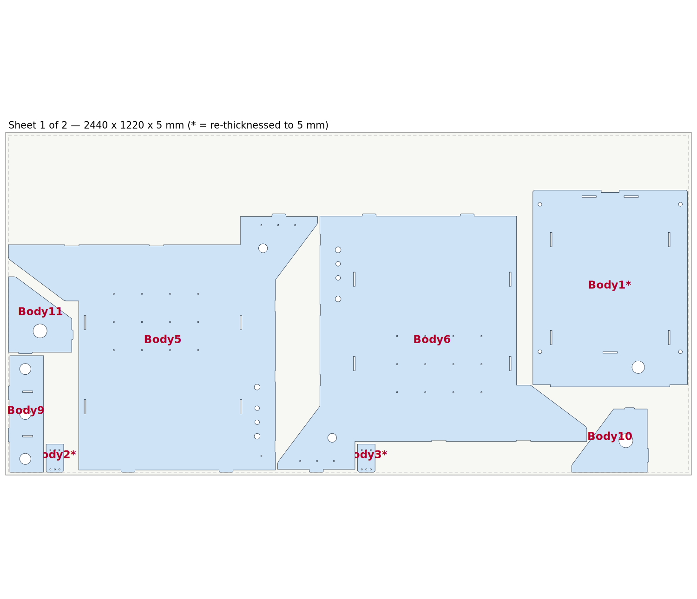
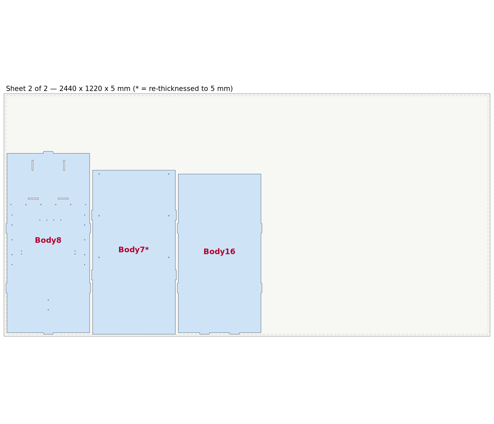

# CNC Workstation V1 — 5 mm laser-cut nest

Flat-pattern nest of the laser-cut plates in `CNC_WorkstationV1.step`, standardised to
**5 mm** stock and arranged on 2440 × 1220 mm sheets (mild steel / stainless, fiber laser).




## Complete body census

The source STEP holds 17 solids across **five different material thicknesses**. Thickness is
measured from the geometry — the direction of smallest extent, verified prismatic
(volume = projected area × extent) — not from bounding boxes, which lie for the parts
that sit at an angle in the assembly (four of them read 16.57 mm but are really 1.5 mm sheet).

| Material | Bodies | Kind | In this nest? |
|---|---|---|---|
| **5.0 mm** | Body11, Body5, Body6, Body8, Body9, Body10, Body16 | flat plate | ✅ all 7 |
| **4.0 mm** | Body7 (825 × 425) | flat plate | ✅ standardised up to 5 mm |
| **8.0 mm** | Body1 (700 × 550), Body2, Body3 (104 × 63) | flat plate | ✅ standardised down to 5 mm |
| 10.0 mm | Body12 (425 × 275) | flat plate | ❌ excluded on request |
| 1.5 mm | Body22, Body17, Body18, Body19, Body20 | **bent** sheet, 6–13 bend faces | ❌ see below |

**On the re-thicknessed parts.** Body7 goes 4 → 5 mm, which makes it stiffer — safe. Body1,
Body2 and Body3 go 8 → 5 mm, which removes 37 % of their section; these are structural
plates, so verify the load path before cutting. Both changes were requested explicitly.

**Why the 1.5 mm parts are left out.** They are bent, not flat. They need unfolding to flat
patterns (which requires a bend allowance / K-factor), and their bend radii are sized for
1.5 mm sheet — 5 mm steel will not form to them. They belong on a separate 1.5 mm nest.

## Nest parameters

| | |
|---|---|
| Sheet | 2440 × 1220 × 5 mm |
| Parts / sheets | 11 on 2 |
| Edge margin | 10 mm |
| Required part gap | 6 mm |
| **Achieved minimum clearance** | **6.4 mm** |
| Kerf | 0.2 mm — **not** baked into the geometry, apply compensation in your CAM |
| Net cut area | 2.826 m² |
| Sheet 2 remnant | ~1145 × 1200 mm free |

Parts are rotated in 90° steps only, never mirrored and never scaled, so each cut profile
is identical to the source model. Profile nesting (rather than bounding boxes) lets the
small parts drop into the side panels' concave notches — Body9, Body10 and Body11 all sit
inside cut-outs of Body5/Body6.

## Files

| File | Use |
|---|---|
| `nest/CNC_Workstation_5mm_NEST_Sheet1.step` / `_Sheet2.step` | arranged 3D models, all solids flat on Z=0 at 5 mm |
| `nest/CNC_Workstation_5mm_NEST_AllSheets.step` | both sheets in one file, sheet 2 offset +1320 mm in Y |
| `nest/CNC_Workstation_5mm_NEST_Sheet1.dxf` / `_Sheet2.dxf` | cutting geometry, layers `CUT_OUTER` / `CUT_INNER` / `SHEET`, origin at sheet corner, mm |
| `nest/*.svg`, `nest/*_preview.png` | visual check |
| `nest/nest_transforms.json` | per-body 3×4 placement matrices (mm) |
| `fusion360_nest_5mm.py` | Fusion 360 script that performs this arrangement inside Fusion |

## Running the nest inside Fusion 360

1. Open `CNC_WorkstationV1.step` in Fusion 360.
2. **Utilities → ADD-INS → Scripts and Add-Ins → Scripts → “+” →** add `fusion360_nest_5mm.py` → **Run**.
3. The eleven plates are moved flat and nested; sheet 2 is offset clear in Y. Every other body is hidden.
   Sheet outlines and 10 mm margins are drawn as sketches.

Bodies are matched by name first, then by volume + centroid, so the script survives Fusion
renaming bodies on import. Fusion's API works in centimetres; the baked matrices are
millimetres and are converted at run time.

One caveat: Fusion moves the *real* Body7 solid, so it still reads 4 mm thick on the sheet.
The cut profile is unchanged — cut it from 5 mm stock, or just use the DXF, which is already
the 5 mm nest.

## Regenerating

```bash
pip install cadquery-ocp numpy
cd tools
python analyse_bodies.py   # names, volumes, centroids
python census.py           # material + flat/bent classification of all 17 bodies
python recheck.py          # prismatic-direction thickness test
python allplates.py        # select plates, re-cut each profile in 5 mm stock
python nest11.py           # profile raster nest + placement-order search -> layout_all.json
python build_all.py        # exact verification + STEP/DXF/SVG export
python emit_fusion2.py     # placement matrices
python gen_fusion2.py      # emit the Fusion 360 script
```

`build_all.py` is the gate. It rejects any layout where two footprints overlap (boolean
common area > 0), where clearance drops below the required gap, or where a part leaves the
sheet margin. The published layout passes with 0.0000 mm² overlap and 6.600 mm minimum
clearance. `emit_fusion2.py` separately asserts every matrix is a proper rotation
(det = +1) reproducing the plan to ~1e-13 mm.

The raster nester spaces parts with a **Euclidean-disk** dilation. A repeated 4-neighbour
dilation is a diamond, which only guarantees the gap along the axes and gap/√2 diagonally —
that under-spaced a diagonal pair to 5.25 mm on an early 11-part layout, which the exact
gate rejected. `nest11.py` carries a unit check for the disk.

## Caveats

- Kerf compensation is deliberately **not** applied to the geometry — set it in the laser CAM
  so parts come out at nominal size.
- Body7 is cut 1 mm thicker than the model specifies; Body1/2/3 are cut 3 mm thinner. Check
  fit against mating parts, and check the load path for the three 8 mm structural plates.
- Mirroring is not used. If your material is isotropic and you are happy to flip plates over,
  allowing mirrored placements may nest tighter.
- The 6 mm gap suits fiber-laser cutting of 5 mm steel. Re-run `nest11.py` with a larger
  `GAP` if your cutter needs more.
