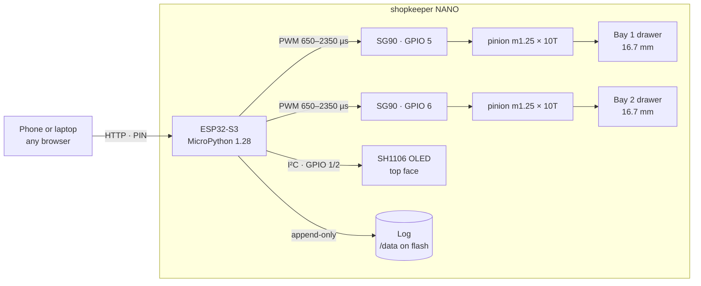

<p align="center">
  
</p>

<p align="center">
  
  
  
  
</p>

<p align="center">
  
  
  
  
</p>

**A tool crib that knows who took what.**

Type a PIN on your phone and the one drawer you are cleared for slides itself open. Take what you
need, push it shut, and the pick is logged against your name. Try the other drawer and nothing
moves.

Built as a working demonstrator to pitch against the industrial smart tool cabinets that land in
India around **₹20 lakh**. Same job, out of about 140 g of filament and roughly ₹2,000 of parts.

<p align="center">
  
</p>

<table>
<tr>
<td width="50%"></td>
<td width="50%"></td>
</tr>
<tr>
<td align="center"><em>16.69 mm of travel, commanded</em></td>
<td align="center"><em>92 × 74 × 66 mm, 140 g of filament</em></td>
</tr>
</table>

> Every image and animation in this README is rendered from the shipped meshes by
> [`tools/make_assets.py`](tools/make_assets.py), through a numpy software rasteriser
> ([`tools/render.py`](tools/render.py)) written for the job because there is no GPU here. The
> mechanism animation turns the pinion by θ and slides the drawer by `R_P·θ` — the same relation
> the firmware commands. Nothing is drawn by hand, so if the geometry is wrong the picture is wrong.

| | |
|---|---|
| **Machine** | shopkeeper **NANO**, 92 × 74 × 66 mm |
| **Geometry** | frozen — `nano/*.stl` is what goes on the plate |
| **Firmware** | 1.0.0, running on the board |
| **Print** | 2 plates, 140 g solid (~119 g sliced) |
| **Bench** | 60/60 open-close cycles on bay two, no failures, no brownout |
| **Spec** | [`docs/superpowers/specs/2026-08-08-toolcell-design.md`](docs/superpowers/specs/2026-08-08-toolcell-design.md) |
| **Lineage** | [`docs/history.md`](docs/history.md) — four superseded generations and what killed each |

---

## Why it exists

A machine shop bleeds tooling. Not dramatically — a carbide end mill walks off, nobody
remembers who had it last, and the shop buys another. Nobody is stealing; nobody is keeping
a record either. Multiply by a year and it is a real number, and it never appears on any
report because there is nothing generating one.

The fix is not measurement. You do not need to weigh, photograph or tag anything to change
behaviour — you need a drawer that stays shut until somebody is cleared to open it, and a
line in a log with their name on it. **Nobody walks off with a tool their name is attached
to.** The deterrent is the record.

So this is exactly that, and nothing beyond it: controlled access plus an append-only log,
on top of a tool database. **It counts nothing, and the interface says so** rather than
implying a measurement it never takes. There is no load cell, no camera, no RFID, and the
page does not pretend otherwise.

Built in 36 hours out of 140 g of filament and about ₹2,000 of parts, so the argument can be
made with a working machine on the table instead of a slide.

---

---

## The machine that exists

<p align="center">
  
</p>

<table>
<tr>
<td width="33%"></td>
<td width="33%"></td>
<td width="33%"></td>
</tr>
</table>

Not a render — the printed article, powered up, mid attract-loop. The panel is
showing the scripted demo counting down; the two lamps are the bay indicators;
the mark on the lid is a separate part pressed into a debossed pocket, printed
in the same 0.4 nozzle as everything else.

Everything on this page is measured from that object or from the meshes that
produced it. **260 open-close cycles, zero failures**, both bays driven
simultaneously.

Photographs were cut from their background with `tools/cutout.swift`, which
uses Vision's foreground-instance mask — the same engine behind Preview's
Remove Background. The obvious route was `rembg`, which cannot be installed
here: `onnxruntime` has no build for Python 3.14.

---

---

## Bench results

| run | result |
|---|---|
| bay 2, sequential | 60 / 60 |
| bay 1, **concurrent** | 100 / 100 |
| bay 2, **concurrent** | 100 / 100 |
| **total** | **260 cycles · 0 failures · 0 reboots** |

The last two runs drove **both bays at once** — two servos under load on one rail, which is the
worst case for supply sag. Nothing reset.

A cycle only counts if the harness polled until the drawer stopped moving **and** its own open
flag had flipped. The API returns `202` on acceptance, so counting requests would have proved
nothing. Harness and raw reports: [`tools/bay2_endurance.py`](tools/bay2_endurance.py).

## How it works



Everything is on the board. No cloud, no broker, no account — the cabinet raises its own
access point, so it works in a meeting room with no wifi and keeps working when the internet
does not.

The log is written **before** the confirmation goes back, so a move that happened is always
recorded even if the network drops mid-reply. The record is the product; it does not get to be
best-effort.

Sequence and state diagrams are in [`docs/BUILD.md`](docs/BUILD.md).

## Geometry for a client or a machine shop

Every part, in three formats. **The mesh is the same object in all of them** — one generator,
one export.

### → [**`MODELS/`**](MODELS/) ← everything is in here

| folder | format | for |
|---|---|---|
| [**`MODELS/STL/`**](MODELS/STL) | STL | printing, and 3D CAM — **start here** |
| [`MODELS/OBJ/`](MODELS/OBJ) | OBJ | import into almost anything |
| [`MODELS/PLATES-3MF/`](MODELS/PLATES-3MF) | 3MF | slicer-ready plates, orientation baked in |
| [`MODELS/DXF/`](MODELS/DXF) | DXF, mm | flat profiles for laser, waterjet or 2D cut |

[`MODELS/README.md`](MODELS/README.md) lists every part with its size and what it does.

<p align="center">
  
</p>

**There is no STEP file, and it is worth saying why.** STEP is a boundary representation —
exact surfaces, true arcs, named faces. This geometry is a triangle mesh, authored for a
printer. Converting mesh to STEP does not recover what was never in it: you get a solid built
from thousands of facets, which imports and looks correct and is unpleasant to machine, because
every cylinder is really a polygon and the toolpath chatters around it.

If the shop wants proper B-rep, the honest route is to rebuild from `cad/nano.py` — every
dimension is a named entry in the `P` dict at the top of that file, and each part function
reads as a recipe. It is half a day for a CAD operator and the result is genuinely machinable.
Importing the STL into Fusion or FreeCAD and converting to solid is the fast, faceted
alternative and is fine for a one-off.

Regenerate the exports at any time:

```sh
.venv/bin/python cad/export_cam.py     # rebuilds MODELS/ entirely
```

---

---

## Scaling it

Two drawers is the demonstrator. Nothing about the approach is limited to two, and the reason
is the same rule that makes it secure: **only one drawer is ever open.** That single constraint
is what keeps a hundred-drawer wall cheap to power and simple to reason about.

| | drawers | actuation | power | what changes |
|---|---|---|---|---|
| **demonstrator** | 2 | 2 × SG90 direct from the board | USB power bank | — |
| **one cabinet** | 16 | 1 × PCA9685, 16 channels over I²C | 5 V 3 A | one driver board, same firmware loop |
| **a bay of cabinets** | 100+ | 7 × PCA9685 on one I²C bus | 5 V 5 A | addressing, not architecture |
| **a shop** | 32 cabinets | one controller each | local | a server that aggregates the logs |

### Why the power does not scale with the drawers

An SG90 pulls about 700 mA while it moves and nothing at all when it is detached — the firmware
already cuts the signal once a move settles. Because access control means **one drawer at a
time**, the worst case is one servo moving plus a hundred sitting idle, not a hundred moving.
A hundred-drawer wall draws about what this two-drawer box does.

That is not a lucky coincidence. The security model and the power budget are the same
constraint viewed twice.

### What actually gets harder

The mechanism scales by repetition. The hard parts are elsewhere, and they are all software:

- **Identity.** A 4-digit PIN does not survive fifty operators. It becomes an RFID badge or a
  phone, and the log has to carry a person rather than a session.
- **The database.** One cabinet can keep its log in flash. Thirty-two cabinets need a server,
  and the cabinets need to keep working when it is unreachable — local log, sync on reconnect.
- **Integration.** A shop wants tool consumption against a job number and a cost centre, which
  means talking to whatever ERP already exists.
- **Actuation, for real drawers.** An SG90 moves a 20 g printed bin. A drawer rated for 80 kg
  of tooling wants a proper geared motor or a solenoid latch and a gas strut. The rack and
  pinion stays; the motor changes.

**None of that is a hardware problem, and that is the point.** The cabinet is the cheap half.
What a shop is buying is controlled access and a record — and that is where both the difficulty
and the value sit.

---

## What it deliberately isn't

**It does not count anything.** Stock decrements because the software said you would take two.
Worth repeating, because it is the crux of the pitch rather than an apology: the ₹20 lakh cabinets
work the same way. Their inventory is trust-based, with no sensors anywhere in the product. The moat is access
control and the database, not sen## Geometry

### → [**`MODELS/`**](MODELS/) ←

| folder | for |
|---|---|
| [**`MODELS/STL/`**](MODELS/STL) | printing and 3D CAM — **start here** |
| [`MODELS/OBJ/`](MODELS/OBJ) | import into almost anything |
| [`MODELS/PLATES-3MF/`](MODELS/PLATES-3MF) | slicer-ready plates, orientation set |
| [`MODELS/DXF/`](MODELS/DXF) | flat profiles, mm, for laser or waterjet |

<p align="center">
  
</p>

No STEP: this is a triangle mesh authored for a printer, and converting mesh to B-rep does not
recover surfaces that were never there. For real B-rep, rebuild from the `P` dict in
[`cad/nano.py`](cad/nano.py) — every dimension is one named number.
[`MODELS/README.md`](MODELS/README.md) lists every part and its size.

