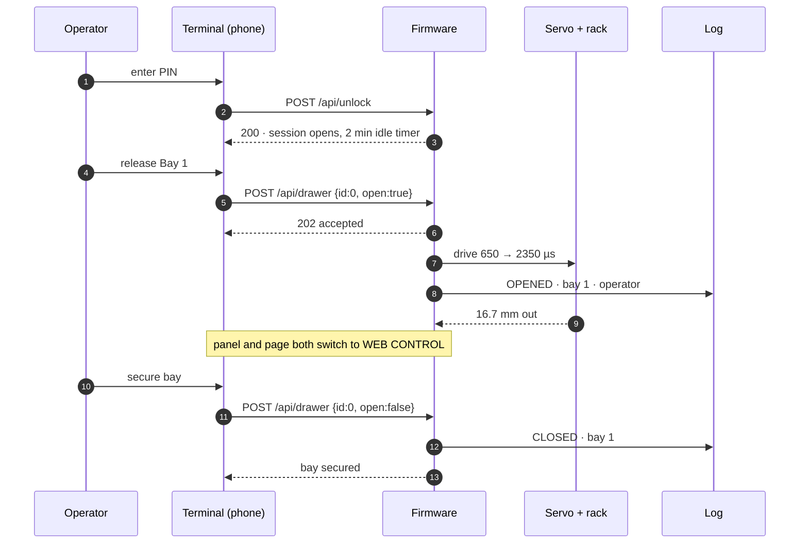
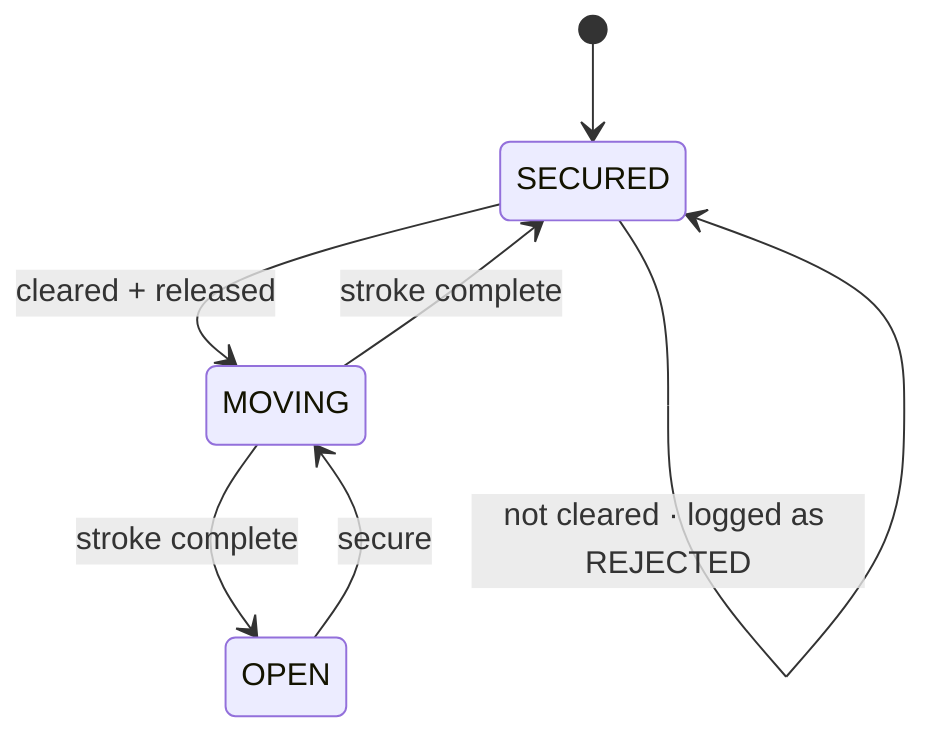

# Building shopkeeper NANO

Everything needed to print it, flash it, wire it and check it. The pitch lives in
[the README](../README.md); this is the manual.

---

## The argument

The established smart tool cabinets land in India at roughly ₹20 lakh. They are serious machines:
800 × 790 mm on the floor, drawers rated 80 kg, up to 48 compartments per drawer, nine cabinets
daisy-chained per controller, three lock tiers rising to a per-compartment electronic flap.

The finding that shapes this whole project is this:

> **They sense nothing.** No load cells, no cameras, no RFID on the tools. Inventory is
> trust-based. The system knows stock because it locked everything except the one box it told you
> to open, and then assumed you took the quantity on the screen. There is a manual *stock
> adjustment* function precisely because reality drifts.

So the moat is not sensing. It is **mechanical access control plus a record of who opened what**,
sitting on top of a good tool database. The cabinet is the cheap half; the software stack — central
tool database, cost centres and user groups, shopfloor pick client — is what commands the price.

That is why a ₹2,000 machine can stand in a room next to a ₹20 lakh one and make an argument. It
does the mechanically honest part — a drawer that is locked until you are cleared, and a log that
says who opened it — and it claims nothing beyond that. **It does not count anything**, and the UI
says so rather than implying a measurement it never takes.

These systems are priced for European tier-1 automotive suppliers. Most Indian job shops will never
buy at ₹20 lakh. A system doing 80% of the job at ₹4–5 lakh addresses a real, unserved market, and this is
the door-opener that gets you into the room to talk about it.

---

---

## The machine

Two drawers **side by side**, not stacked, so one mechanism deck serves both. Stacking would have
doubled the height, because a vertical SG90 costs 26 mm of dead space under every deck.

```
    z 66  ┌──────────────────────────────┐
          │  top face: OLED window,      │   case_upper, 24 mm
          │  2× LED holes, debossed mark │   prints top-face-down
    z 42  ├──────────────────────────────┤
          │  bay: 2 drawers, 18 mm deep  │   deck at z 39.5 .. 42
    z 39  ├──────────────────────────────┤
          │  mech bay: 2× SG90 shaft-up, │   case_lower, open top,
          │  2 pinions, ESP32-S3 + board │   prints floor-down
    z  0  └──────────────────────────────┘
                    92 × 74 mm
```

| | |
|---|---|
| Case | 92 × 74 × 66 mm |
| Drawer, each | 39.8 × 59 × 18 mm body (+3 mm anti-tip rib), **36.0 × 54.0 × 16.2 mm** of bin |
| Deck | 2.5 mm, top face at z 42 |
| Gearing | module **1.25**, **10 teeth**, 14.5° pressure angle, 6 mm face |
| Pitch radius | **6.25 mm** |
| Full travel | **19.63 mm** = π × 6.25 = one **half turn** of the pinion |
| Travel as shipped | **16.69 mm** — the firmware commands 650–2350 µs = 1700 µs = 153° |
| Reserve | **2.94 mm** the mechanism can do that the firmware never asks for |
| Still on the deck | 39.4 mm of a 59 mm drawer at *full* travel |
| Mass | 140 g solid over 2 plates, ~119 g sliced |

### Why 16.69 and not 19.63

An SG90 nominally spans 500–2500 µs for 180°, but clones stall against their own end stop somewhere
past 160° and cook themselves holding there. So the shipped endpoints deliberately ask for less
than the mechanism can do:

```
span_us / 2000 × 180 = degrees          degrees / 180 × 19.63 = mm of drawer
650 .. 2350  →  1700 µs  →  153°  →  16.69 mm of the 19.63 available
```

16.69 mm opens 28% of a 59 mm drawer, which is enough to reach the front row. The remaining 2.94 mm is
headroom, not a shortfall — and the **Calibrate** panel in the UI jogs each servo live while you
watch the real drawer, then writes the endpoints to `/data/cal.json`. Set them by eye against the
printed part, not from this table.

### How it drives

<p align="center">
  
</p>

<p align="center">
  
</p>

A rack and pinion, and the rack is **not a separate part** — the teeth are moulded into a blade
that hangs off the drawer's own underside. One piece, nothing to peg in, nothing to come loose.
The drawer body is left out of these two pictures because it sits directly over the mesh and hides
it completely.

The gear lies flat on a vertical servo shaft, like a turntable, so its teeth face **sideways**. That
single fact decides the whole layout: a rack cut into a drawer floor would present its teeth
downward at a gear that never looks that way, and could not have driven anything. The teeth have to
be on a vertical face, which is why the blade hangs below rather than lying flat.

### The two details that were nearly fatal

**Stub teeth.** A full-depth involute at m1.25 comes to a 0.45 mm tip — under one extrusion width,
so the machine rounds it off and the contact it was supposed to make never happens. The addendum is
0.8 module instead of 1.0, which puts the tip at 0.75 mm and still leaves a contact ratio of 1.8.

**The SG90's output shaft is not centred on its body.** It sits ~5.9 mm from one end, which is
plain to see on the part and was modelled nowhere. The servo pocket was centred on the pinion axis,
so the servo either would not go in at all or would put its shaft 5.5 mm off the axis — a
centre-distance error half as big as the pitch radius. The gear pair could never have meshed.

---

---

## Every part

<p align="center">
  
</p>

<p align="center">
  
</p>

Top to bottom: the lid, two drawers each carrying its own toothed blade, the deck the drawers ride
on with a bore for each gear, the two pinions, the two SG90s in their wells, and the base with the
ESP32 bay behind them.

---

---

## Print it

The meshes in `nano/` are the build. You do not have to run any Python to print.

| Plate | File | Objects | Mass | Colour |
|---|---|---|---|---|
| 1 — case | `nano/plates/plate_1_case.3mf` | `case_lower`, `case_upper` | **89.3 g** | white |
| 2 — mechanism | `nano/plates/plate_2_mechanism.3mf` | `deck`, 2× `drawer`, 2× `pinion`, 2× `servo_shim`, `spline_gauge`, `logo_inlay` | **60.0 g** | yellow |

One colour per plate, so a single-nozzle machine makes **zero filament changes** — swap the spool
between the two prints. Both plates fit a 256 mm bed. A plain `.stl` sits beside each `.3mf`: an
STL carries no filament or extruder data at all, so a slicer cannot stop and ask you to map
materials.

`nano/plates/plate_ALL.3mf` puts everything on one colour-coded plate. That one is for **looking
at**, not for printing — it declares materials, so a slicer will stop and ask you to map filaments.

Nine STLs are generated; eight of them are on the plates. `knob.stl` is the alternative to the
scalloped finger pull moulded into the drawer front, and is only printed if you set `P["pull"] =
"knob"` and regenerate.

**Print orientation is already baked into the plates.** `case_upper` is flipped and printed
top-face-down: the debossed mark's edges then form against the bed, which is the crispest surface
the machine makes. `pinion` prints gear-face-down with the horn pocket up.

### Assembly order

1. Screw each SG90 down onto its **`servo_shim`** — a 1.6 g part whose only job is to set the
   servo height. That height sets the horn height, which sets the pinion height, which decides
   whether the gears engage at all. If your servo measures differently, reprint the 1.6 g shim, not
   the 89 g case.
2. Drop both servos into the open wells in `case_lower`, leads out through the cable notch, and
   pick up the flange with M2 self-tappers through the vertical pilot slots. The slots are slots,
   not holes, because clone SG90s vary about 1 mm in where the flange sits. The wells go all the
   way to the floor and their walls stop below the lowest ear, so the shim — not the case — is
   what sets the height.
3. Press a `pinion` onto each horn.
4. Plug the ESP32-S3 into its breadboard and slide the assembly into the rails at the rear. The
   dovetails are handed: pegs on one wall, notches on the other, so it goes in one way round. The
   twin USB-C ports face the **right-hand** wall, where the window is.
5. Lay the `deck` on its ledges, drop both drawers on, and mesh each drawer's own blade with its
   pinion. There is no rack to fit — it prints as part of the drawer.
6. `case_upper` goes on over the three alignment pins. No magnets and no screws.
7. Optional: press `logo_inlay` into the debossed mark on the top face.

---

---

## Flash it

MicroPython on an ESP32-S3. Tested on the board in hand: **MicroPython 1.28.0**, 2.0 MB free heap.
Full detail in [`firmware/README.md`](firmware/README.md).

```sh
PORT=/dev/cu.usbmodem5A790574951          # yours will differ; ls /dev/cu.*
mpremote connect $PORT mkdir :www
for f in config.py servo.py store.py server.py main.py; do
  mpremote connect $PORT cp $f :$f
done
mpremote connect $PORT cp www/index.html :www/index.html
mpremote connect $PORT reset
```

Wiring is four connections:

| | |
|---|---|
| Drawer A servo signal | GPIO 5 |
| Drawer B servo signal | GPIO 6 |
| Servo V+ | **5 V, not the 3V3 rail** |
| Servo GND | common with the ESP32 GND |

Two SG90s stalling together pull well over an amp. Power them from the 5 V pin or a separate
supply — a USB port feeding the 3V3 regulator will brown the board out mid-move and you will spend
an afternoon blaming the code.

### Run it

The cabinet brings up **its own access point**, because a demonstrator has to work in a meeting room
with no guest wifi. Copy `firmware/secrets_example.py` to `firmware/secrets.py` (gitignored) and set
`AP_PASSWORD` — the firmware refuses to start the AP without one. Set `JOIN = ("ssid", "password")`
there too to try an existing network first and fall back to the AP.

| | |
|---|---|
| SSID | `shopkeeper-NANO` |
| Password | `AP_PASSWORD` from `firmware/secrets.py` |
| URL | **http://192.168.4.1/** |
| PIN | `2468` — but see below |

**The PIN gate ships disabled.** `REQUIRE_PIN = False` in `firmware/config.py`, because it was in
the way during bench testing. The cabinet as flashed will open either drawer for anyone who loads
the page, and the UI says `pin bypassed — bench mode` rather than pretending otherwise. Set
`REQUIRE_PIN = True` before you demo it to anyone, which is the whole argument of the project.

With it on, the UI locks itself again after two minutes idle. Every open, close, unlock and rejected PIN is
written to an append-only log. `GET /api/state` returns the lot; everything except `/api/state`,
`/api/unlock` and `/api/lock` returns **403** while the cabinet is locked.

To work on the UI without joining the cabinet's AP — which on a laptop means giving up your
internet — run the desktop mock. It serves the real `www/index.html` against a simulated cabinet
and imports the real `config.py`, so the tool lists, PIN, timeouts and servo endpoints are the ones
the hardware actually runs:

```sh
.venv/bin/python firmware/mock_server.py --port 8732
```

---

---

## The terminal

<p align="center">
  
</p>

A machine HMI, not a web app: a live section drawing of each bay with the drawer at its measured
position, the tool register, and an append-only event ledger. Served off the ESP32 itself as a
single 40 KB file with **no CDN, no framework and no network call of any kind** — it has to work in
a meeting room where the cabinet is the only thing on the network.

<table>
<tr>
<td width="42%" valign="top"></td>
<td width="58%" valign="top"></td>
</tr>
<tr>
<td align="center"><em>the gate — the whole product, in one screen</em></td>
<td align="center"><em>and on the phone that actually opens it</em></td>
</tr>
</table>

Shot by [`tools/shoot_ui.py`](tools/shoot_ui.py) against `firmware/mock_server.py`, which imports
the real `firmware/config.py` — so the register, PIN, timeouts and servo endpoints on screen are the
ones the hardware runs.

---

---

## Print it faster

For a demonstrator that carries no load, the drawer prints in **13m 01s and 6.73 g** instead of
20m 00s and 10.52 g — 35% less time, 36% less PLA — with no dimension changed. Import
`print_profiles/shopkeeper DEMO 0.30.json`, or set four values: layer height 0.30, **1** wall loop,
**0%** infill, 0.8 mm top and bottom shells.

Measured by running the slicer headless across a sweep
([`tools/demo_sweep.py`](tools/demo_sweep.py)), not estimated. Three results worth having:

- **Raising print speed does nothing.** Outer wall 200 → 300 → 400 mm/s changed the time by zero
  seconds; the walls are too short for the head to reach the commanded feedrate.
- **Cutting lightening holes makes it *slower*** — up to +24% for −22% PLA. Deleting infill that is
  already 0% saves two seconds, while the broken-up perimeters push travel and retraction from 62 s
  to 285 s ([`tools/cutout_test.py`](tools/cutout_test.py)).
- **The shipped "0.24mm Standard" preset slices at 0.20.** It carries no layer height of its own and
  inherits one from its base.

For a drawer that will hold real steel, use `print_profiles/shopkeeper PROTOTYPE 0.24.json`
instead — 15m 31s, 8.48 g, two walls.

---

---

## Verify it

On this project the silent failures were the expensive ones, so nothing is trusted twice. Every
checker below **measures the shipped meshes** rather than reading intent out of the source — the
source has been right and the mesh wrong more than once here.

| Command | Asks |
|---|---|
| `.venv/bin/python cad/preflight.py` | **Go/no-go before filament is spent.** Assembles every real mesh in its true pose, adds a solid proxy for the SG90, and boolean-intersects every pair. Anything that overlaps cannot be assembled. Then measures the gear mesh off the geometry and sweeps both drawers through full stroke. |
| `.venv/bin/python cad/meshsim.py` | **Does the gear pair actually turn, at the size the machine prints?** Rolls the pair through a full tooth cycle in 2D at several print growths and reports the tightest gap. Dilating a polygon is exactly what an FDM machine does to a part. |
| `.venv/bin/python cad/fitcheck.py` | **Every mating fit, ray-cast off the real STLs.** Finds the actual hole and slot widths and compares them to the actual peg and blade widths. Bands are for PLA, not PETG — PETG takes an interference fit by deforming, PLA takes it by snapping. |
| `.venv/bin/python cad/overhangs.py` | **What prints into thin air.** For every downward-facing face, cast a ray straight down; if it hits nothing, that face is unsupported. Reports total area and where, so the fix can be geometric rather than "enable supports". |
| `.venv/bin/python cad/tolerances.py` | The same fits computed *from the parameters* — what the design intended, as a cross-check on what it achieved. |

`cad/nano.py` also carries about twenty of its own assertions and refuses to export if any fail:
the pinion is on the rack at both ends of travel, the fin stays keyed in the deck slot, the servo
fits under the deck, the two servos do not clash, the ears stay inside the case, the tooth tip is
printable at ≥0.60 mm, every part is watertight and a single body, and an erosion test finds the
narrowest neck in each part's **first layers** — because watertight and single-body both pass on a
part hanging together by 0.6 mm, which is exactly how the deck once shipped.

### Look at it

`nano/viewer/index.html` is a self-contained interactive 3D viewer built from the real STLs —
13,343 unique triangles, 17,119 drawn per frame assembled, 17,759 exploded. Hand-rolled canvas-2D
painter's-algorithm renderer: no CDN, no external script, no font, no network call of any kind.
Open the file.

### Regenerate

```sh
python3 -m venv .venv
.venv/bin/pip install numpy trimesh manifold3d networkx shapely mapbox_earcut pillow
.venv/bin/python cad/nano.py         # → nano/*.stl + nano/plates/*
```

Every dimension lives in the `P` dict at the top of `cad/nano.py`. Change a number, re-run.

Two things worth knowing before you do:

- `cad/logo.py` traces the debossed mark from a **bitmap on the author's machine**
  (`~/Desktop/Screenshot*5.37*.png`). Point `SRC_GLOB` at your own artwork, or call
  `trace(src=...)`, or the run stops there.
- `preflight.py`, `fitcheck.py`, `meshsim.py` and `tolerances.py` all `import nano`, which re-runs
  the generator — so **running a checker rewrites `nano/`**. That is deliberate (they check what
  shipped, not what was meant), but it means the checkers write to the directory your slicer reads.
  `overhangs.py` and the viewer do not.

---

---

## Repo map

| Path | |
|---|---|
| `nano/*.stl` | **the build** — 9 parts |
| `nano/plates/` | 2 print plates as `.3mf` and `.stl`, plus the one-plate viewing copy |
| `nano/viewer/index.html` | self-contained 3D viewer |
| `cad/nano.py` | the whole machine — parts, assertions, plating |
| `cad/logo.py` | traces the Ommi Forge mark from a bitmap into a debossable polygon |
| `cad/mf3.py` | 3MF writer — trimesh 5.0 emits an empty `<build>` section and drops names |
| `cad/preflight.py` `meshsim.py` `fitcheck.py` `overhangs.py` `tolerances.py` | the checkers |
| `cad/viewer3d.py` `build_page.py` `mounts_page.py` `render_sections.py` | viewer and drawing generators |
| `firmware/` | MicroPython — servo driver, store, HTTP server, UI, desktop mock |
| `cad/cabinet.py` `slidebox.py` `mini.py` `toolcell.py` | superseded generations, see [`docs/history.md`](docs/history.md) |
| `tools/measure_stl.py` | bounding boxes and ray-cast internal cavities of any STL |
| `tools/render.py` | numpy software rasteriser — z-buffer, three-point lighting, planar shadow |
| `tools/make_assets.py` | every image and animation in this README, from the shipped meshes |
| `tools/bay2_endurance.py` | the 60-cycle hardware test |
| `tools/print_sweep.py` `demo_sweep.py` `cutout_test.py` | headless slicer sweeps |
| `tools/shoot_ui.py` | terminal screenshots via headless Chromium |
| `print_profiles/` | Bambu Studio process presets for demo and prototype prints |
| `docs/img/` | rendered stills and animations |

---

## Bill of materials

| | Qty | ₹ |
|---|---|---|
| ESP32-S3 dev board + half-size breadboard | 1 | on hand |
| SG90 servo (MG90S for a pilot) | 2 | on hand |
| M2 self-tapping screws, servo flanges | 4 | ~100 |
| Dupont leads | — | on hand |
| Filament, ~140 g | — | ~120 |
| 0.91″ SSD1306 OLED, I²C *(optional)* | 1 | ~150 |

Runs off a USB power bank, so it sets up on a meeting table with no socket.

The top face carries a 26 × 10 mm window and two 5 mm LED holes. They are **provision**: firmware
1.0.0 is web-UI only and drives neither. The PIN is entered on a phone, which is also how the
original spec's 4×4 keypad disappeared from the BOM.

---

## Sequence and states

### An authorised pick



The log is written **before** the confirmation goes back, so a move that happened is always
recorded even if the network drops mid-reply. The record is the product; it does not get to
be best-effort.

### What a bay can be



Four states and no others. There is no drawer-position switch in v1 — the firmware assumes a
commanded move completed, which is honest but not sensed, and a microswitch is the correct
fix at about ₹30.

---

---

